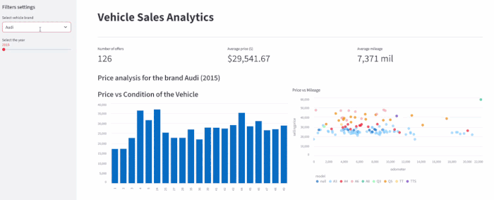

# 🚗 Vehicle Sales Analytics Pipeline

[](https://aws.amazon.com/)
[](https://www.python.org/)
[](https://streamlit.io/)

> **End-to-End Data Engineering project** that automates ingestion, transformation, and visualization of vehicle sales data using a serverless AWS architecture.

🔗 **[Live Dashboard Demo](https://dscloudproject-ykxkjvzapgrkdh4sh4q72y.streamlit.app/)**

---

## 🗺️ System Architecture


The pipeline follows a modern **Data Lakehouse** pattern:
`Kaggle API` ➔ `AWS Lambda (Ingest)` ➔ `S3 (Raw CSV)` ➔ `S3 Event` ➔ `AWS Lambda (Transform)` ➔ `S3 (Refined Parquet)` ➔ `AWS Athena` ➔ `Streamlit Cloud`

---

## 🛠️ Tech Stack

* **Compute:** AWS Lambda (Serverless Python 3.12)
* **Storage:** AWS S3 (Raw & Refined Zones)
* **Orchestration:** Amazon EventBridge (Cron) & S3 Event Notifications
* **Data Catalog & Query:** AWS Glue, AWS Athena (SQL)
* **Monitoring:** AWS SNS (Email Alerts)
* **Visualization:** Streamlit Cloud, Pandas, Matplotlib/Seaborn
* **CI/CD & Tools:** Git (Feature-branching), Kaggle API

---

## 🚀 Key Features

### Phase 1: Local Prototype
This initial phase focused on building the core logic and defining the database schema:
1. `src/download_data.py`: Fetches raw data from Kaggle to local storage.
2. `src/upload_to_s3.py`: Transfers CSV files to the AWS S3 `raw_data/` zone.
3. `sql/create_table_vehicle_sales.sql`: Defines the initial schema for raw CSV data.
4. `src/analyze_data.py`: Connects Python to Athena to generate business insights.
5. `run_pipeline.py`: Orchestrates the local execution of the entire flow.

### Phase 2: Cloud Automation (Event-Driven)
This next phase focused on recreating the process of the first one in the order to be manage by AWS environment.
1. **Ingestion (`src/lambda_function.py`)**: Triggered by **EventBridge (CRON)**. Fetches data via Kaggle API and saves it in the **Raw Zone** (`raw_data/{date}/`) using **Incremental Loading**.
    * **Runtime**: Python 3.12
    * **Timeout**: 1 minute | **Memory**: 512 MB
    * **Layers**: `AWSSDKPandas-Python312`, `kaggle-library`
2. **Transformation (`src/lambda_function_parquet.py`)**: Triggered by **S3 Event Notifications** (Prefix: `raw_data/`). Cleans data with Pandas and converts it to **Apache Parquet**.
    * **Runtime**: Python 3.12
    * **Timeout**: 2 minutes | **Memory**: 1024 MB
    * **Layers**: `AWSSDKPandas-Python312`
3. **Custom Layer Creation**: To use the Kaggle API in Lambda, create a custom layer:
```bash
mkdir -p kaggle_layer/python
cd kaggle_layer/python
pip install kaggle -t .
cd ..
zip -r kaggle_layer.zip python
aws lambda publish-layer-version --layer-name kaggle-library --zip-file fileb://kaggle_layer.zip --compatible-runtimes python3.12
```
4. **Partitioning**: Data is stored in the Refined Zone (refined_data/) partitioned by year and month (e.g., year=2026/month=2/) for optimized query performance.
5. **Monitoring (AWS SNS)**: Instant email alerts on failure, managed via Lambda Destinations and internal error handling:
```python
sns.publish(
    TopicArn=os.environ.get('SNS_TOPIC_ARN'),
    Message=f"Lambda failed: {str(e)}",
    Subject="PIPELINE ERROR ALERT"
)
```
6. **Permissions**: The Lambda execution role requires AmazonS3FullAccess, AmazonAthenaFullAccess, and AWSGlueConsoleFullAccess.
7. `sql/create_table_vehicle_sales_parquet.sql`: SQL DDL for the optimized Parquet-based partitioned table.

### Phase 3: Data Visualization & Serving
Developed a serverless dashboard using Streamlit Cloud with two architectural approaches:
1. **Cloud-Heavy Approach (`src/dashboard_cloud_heavy.py`)**: 
   * Delegates all aggregations to AWS Athena. 
   * **Best for:** Massive datasets (Big Data) where local RAM is insufficient.
   * **Trade-off:** Higher AWS costs due to frequent S3 scanning.
2. **Smart Buffer Approach (`src/dashboard_smart_buffer.py`)**: 
   * Fetches full brand data into a Pandas DataFrame and performs sub-filtering locally.
   * **Best for:** Optimal User Experience and cost reduction.
   * **Trade-off:** Requires more RAM on the hosting server.
3. **Data Cleaning at Source**: Implemented Trino-compatible SQL logic to handle case normalization (`UPPER/LOWER`) and filter out `NULL/None` values directly in Athena, ensuring clean data ingestion into the UI.
4. **Athena Staging**: Results of all dashboard queries are managed in: `s3://konrad-ds-project-data/athena-results/`.

---

## 📊 Dashboard Demo



*The dashboard features a **Smart Buffer** logic: it fetches data once per brand selection to minimize AWS Athena costs while providing instant filtering for production years.*

---

## ⚙️ Setup & Installation

### 1. Prerequisites
* AWS Account with CLI configured.
* Kaggle API Token (`KAGGLE_USERNAME`, `KAGGLE_KEY`).

### 2. AWS Environment Variables
Set these variables in your Lambda functions:
* `BUCKET_NAME`: Target S3 bucket name (`lambda_function.py`, `lambda_function_parquet.py`).
* `SNS_TOPIC_ARN`: ARN for failure alerts (`lambda_function.py`, `lambda_function_parquet.py`).
* `KAGGLE_USERNAME` / `KAGGLE_KEY`: For data ingestion (`lambda_function.py`). Obtain these from Kaggle Account settings -> Create New API Token. 
* `S3_STAGING_DIR`: The S3 path where Athena will store query results (e.g., s3://your-bucket-name/athena-results/).

### 3. Local Run
```bash
# Clone the repo
git clone https://github.com/kondimidi/ds_cloud_project.git

# Install dependencies
pip install -r requirements.txt

# Run local pipeline
python run_pipeline.py