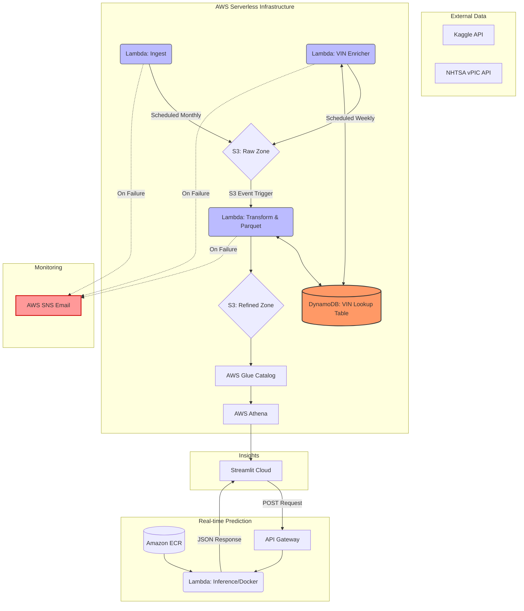

# 🚗 Vehicle Sales Analytics Pipeline

[](https://aws.amazon.com/)
[](https://www.python.org/)
[](https://streamlit.io/)

> **End-to-End Data Engineering project** that automates ingestion, transformation, and visualization of vehicle sales data using a serverless AWS architecture.

🔗 **[Live Dashboard Demo](https://dscloudproject-i3s7cs47ownxgnvko7ptyp.streamlit.app/)**

---

## 🗺️ System Architecture


```mermaid
graph TD
    subgraph External_Sources [External Data]
        K[Kaggle API]
        N[NHTSA vPIC API]
    end

    subgraph AWS_Cloud [AWS Serverless Infrastructure]
        L1(Lambda: Ingest) -- Scheduled Monthly --> S3R{S3: Raw Zone}
        
        S3R -- S3 Event Trigger --> L2(Lambda: Transform & Parquet)
        
        L3(Lambda: VIN Enricher) -- Scheduled Weekly --> S3R
        L3 <--> DDB[(DynamoDB: VIN Lookup Table)]

        L2 <--> DDB
        L2 --> S3P{S3: Refined Zone}
        
        S3P --> GC[AWS Glue Catalog]
        GC --> AT[AWS Athena]
    end

    subgraph Monitoring [Monitoring]
        SNS[AWS SNS Email]
    end

    %% Połączenia monitoringu
    L1 -.->|On Failure| SNS
    L2 -.->|On Failure| SNS
    L3 -.->|On Failure| SNS

    subgraph Presentation [Insights]
        AT --> ST[Streamlit Cloud]
    end

    subgraph Prediction_Layer [Real-time Prediction]
        ECR[(Amazon ECR)] --> L_INF(Lambda: Inference/Docker)
        ST -- POST Request --> APIG[API Gateway]
        APIG --> L_INF
        L_INF -- JSON Response --> ST
    end

    %% Style
    style DDB fill:#f96,stroke:#333,stroke-width:2px
    style L1 fill:#bbf,stroke:#333,stroke-width:1px
    style L2 fill:#bbf,stroke:#333,stroke-width:1px
    style L3 fill:#bbf,stroke:#333,stroke-width:1px
    style SNS fill:#ff9999,stroke:#cc0000,stroke-width:2px
```

---

## 💎 Advanced Data Quality & Enrichment Layer

### 🛡️ 1. VIN-Based Deterministic Enrichment
The system identifies records with missing brand/model information and uses the **NHTSA vPIC API** to decode the **VIN (Vehicle Identification Number)**. 
- **Efficiency**: To minimize latency and API costs, I implemented **Amazon DynamoDB**. 
- **Caching**: Each unique VIN is decoded only once; subsequent runs fetch data directly from NoSQL.

### 🧠 2. Hybrid Entity Resolution
To handle typos and inconsistent naming (e.g., "VW" vs "Volkswagen"), the pipeline combines:
- **Direct Mapping**: High-speed dictionary lookups for known aliases.
- **Fuzzy Matching**: Levenshtein Distance algorithms (**RapidFuzz**) to standardize brands that aren't on the canonical list.

### 🧹 3. Data Integrity & Optimization
- **Automatic Pruning**: Records lacking a valid VIN are automatically removed to ensure 100% data reliability for analytical models.
- **Performance Tuning**: Implemented a vectorized mapping technique with an early exit strategy. The algorithm skips canonical brands and processes only "dirty" data, reducing Lambda execution time by over 90%.

---

## 🛠️ Tech Stack

* **Compute:** AWS Lambda (Serverless Python 3.12)
* **Storage:** AWS S3 (Raw & Refined Zones), DynamoDB (NoSQL)
* **Orchestration:** Amazon EventBridge (Cron) & S3 Event Notifications
* **Data Catalog & Query:** AWS Glue, AWS Athena (SQL)
* **Monitoring:** AWS SNS (Email Alerts)
* **Visualization:** Streamlit Cloud, Pandas, Matplotlib/Seaborn
* **CI/CD & Tools:** Git (Feature-branching), Kaggle API, NHTSA vPIC API, Amazon API Gateway
* **Modeling:** XGBoost, Scikit-learn, Optuna (Hyperparameter Tuning), SHAP (Model Explainability)

---

## 📂 Project Structure

The repository is organized into modular components:

### 🔬 Notebooks (Research & Discovery)
Comprehensive documentation of the analytical journey:
* `01_Exploratory_Data_Analysis.ipynb`: Outlier detection (IQR) and market distribution analysis.
* `02_Regression_and_Depreciation.ipynb`: Multicollinearity checks (VIF) and depreciation rate comparisons.
* `03_Classification_Basics.ipynb`: Logistic regression and ROC/AUC performance metrics.
* `04_Advanced_ML_and_Tuning.ipynb`: Bayesian Optimization with **Optuna** and SHAP explainability.
* `05_Final_Production_Pipeline.ipynb`: Hierarchical modeling logic and Log-transformation implementation.

### 💻 Source Code (`/src`)
* `analytics/`: Scripts for data deep-dives and visualization.
* `apps/`: **Smart Buffer Dashboard** – the main interactive interface.
* `data_pipeline/`: Automated data ingestion, S3 uploads, and VIN enrichment.
* `deployment/`: Lambda handlers and API Gateway testing scripts.
* `model_engineering/`: The core training script for the production-ready models.

---

## 🚀 Key Features

### Phase 1: Local Prototype
This initial phase focused on building the core logic and defining the database schema:
1. `src/data_pipeline/download_data.py`: Fetches raw data from Kaggle to local storage.
2. `src/data_pipeline/upload_to_s3.py`: Transfers CSV files to the AWS S3 `raw_data/` zone.
3. `src/analytics/analyze_data.py`: Connects Python to Athena to generate business insights.
4. `run_pipeline.py`: Orchestrates the local execution of the entire flow.

### Phase 2: Automated Serverless Pipeline
This next phase focused on recreating the process of the first one in the order to be manage by AWS environment.
1. **Ingestion (`src/deployment/lambda_function.py`)**: Triggered by **EventBridge (CRON)**. 
    * Fetches incremental data via Kaggle API and saves it in the **Raw Zone** (`raw_data/{date}/`) using **Incremental Loading**.
2. **Enriching Data (`src/data_pipeline/vin_enricher.py`)**: Triggered by **EventBridge (CRON)**.
    * Fetches official vehicle specifications (Make/Model) from NHTSA API based on VIN.
    * Populates the DynamoDB lookup table to act as a high-speed cache for the main pipeline.
3.  **Transformation & Hygiene (`src/deployment/lambda_function_parquet.py`)**: Triggered by **S3 Events**.
    * **Data Recovery**: Fills missing values by performing a join-like operation with the DynamoDB.
    * **Normalization**: Standardizes vehicle names using Fuzzy Matching and Title Case formatting.
    * **Optimization**: Converts data to Apache Parquet and handles automatic Glue Catalog synchronization (MSCK REPAIR).
    * **Integrity**: Drops records without a valid VIN to maintain a high-quality dataset.
    * **Self-Cleaning**: Automatically purges old partitions to maintain data idempotency.
4.  **Monitoring**: Integrated **AWS SNS** for instant email alerts on pipeline failures via Lambda Destinations.

### Phase 3: Data Visualization & Serving
Developed a serverless dashboard using Streamlit Cloud with two architectural approaches:
1. **Cloud-Heavy Approach (`src/apps/dashboard_cloud_heavy.py`)**: 
   * Delegates all aggregations to AWS Athena. 
   * **Best for:** Massive datasets (Big Data) where local RAM is insufficient.
   * **Trade-off:** Higher AWS costs due to frequent S3 scanning.
2. **Smart Buffer Approach (`src/apps/dashboard_smart_buffer.py`)**: 
   * Fetches full brand data into a Pandas DataFrame and performs sub-filtering locally.
   * **Best for:** Optimal User Experience and cost reduction.
   * **Trade-off:** Requires more RAM on the hosting server.
3. **Data Cleaning at Source**: Implemented Trino-compatible SQL logic to filter out `NULL/Nan` values directly in Athena, ensuring clean data ingestion into the UI.
4. **Athena Staging**: Results of all dashboard queries are managed in: `s3://konrad-ds-project-data/athena-results/`.

### Phase 4: Predictive Price Model
#### 1. Hierarchical Modeling Strategy
To handle market diversity, the system uses two specialized models:
- **Luxury Model:** Fine-tuned for high-end brands (Ferrari, Lamborghini, Tesla, etc.).
- **Standard Model:** Optimized for high-volume market segments.

#### 2. Serverless Inference
The model is packaged into a **Docker Container** and deployed as an AWS Lambda function. This allows for near-instant scaling and "pay-as-you-go" execution costs.

#### 3. Interactive Market Dashboard
* Real-time price predictions via API calls.
* Geographic sales distribution analysis.
* Comparison of depreciation rates across brands.
* Top 5 "Best Value" deals identification.

---
## 📈 Model Performance
The **13.46% MAPE for Luxury models** is particularly impressive given the high variance in high-end vehicle pricing, where the **MAPE** of the **baseline linear model** was **81.32%.**

| Segment | MAE | MAPE | Key Logic |
| :--- | :--- | :--- | :--- |
| Baseline (Simple Linear Regression) | $3380 | 81.32% | Targeted at all brands. |
| Luxury (XGBoost + Log-Trans) | $3801 | 13.46% | Targeted at brands like Ferrari, Tesla, Land Rover. |
| Standard (XGBoost + Log-Trans) | $1613 | 16.08% | Optimized for high-volume makes like Ford, Toyota. |

---

## 💰 Cost Optimization & Management
A strategic decision was made to use a **Serverless Data Lake** instead of a traditional RDS instance:

* **Athena vs. RDS**: By choosing Athena, the project avoids the fixed 24/7 costs of an RDS/Aurora instance.
* **Lifecycle Policies**: Automated S3 Lifecycle rules expire `athena-results/` every 7 days (`raw_data/` every 30 days), preventing storage clutter.
* **Budgeting**: **AWS Budgets** implemented with email triggers to monitor the credit utilization and prevent unexpected billing.

---

## 📊 Dashboard Demo


*The dashboard features a **Smart Buffer** logic: it fetches data once per brand selection to minimize AWS Athena costs while providing instant filtering for production years.*

---

## 🚀 Future Improvements & Roadmap

As the project grows, the following features are planned to enhance its robustness and analytical depth:

### 🏗️ Data Engineering & DevOps
* **AWS Step Functions Workflow**: Migrate from event-based triggers to a managed state machine to handle retries, error branching, and complex dependencies between Lambdas.
* **CI/CD Pipeline (GitHub Actions)**: Automate testing (Linting/Unit Tests) and deployment. Every `git push` will automatically update Lambda code in AWS, replacing manual ZIP uploads.
* **Data Build Tool (dbt)**: Integrate `dbt-athena` to manage complex SQL transformations and data lineage directly in the Refined Zone.
* **Brand Drift Monitoring**: Implement a monitoring system that notifies via SNS when a significant volume of new, unknown car brands (not in the canonical list) enters the pipeline.

### 📈 Advanced Analytics & Machine Learning
* **Interactive EDA Dashboard**: Expand the Streamlit UI with an Exploratory Data Analysis module to uncover hidden correlations (e.g., price vs. regional popularity).
* **External Data Enrichment**: Implement Web Scraping to fetch real-time exchange rates or inflation data to analyze their impact on car market volatility.
* **Data Quality Dashboard**: Add a dedicated view in Streamlit to monitor the % of recovered records via VIN decoding.

---

## ⚙️ Setup & Installation

### 1. Prerequisites
* AWS Account with CLI configured.
* Kaggle API Token (`KAGGLE_USERNAME`, `KAGGLE_KEY`).

### 2. AWS Environment Variables
Set these variables in your Lambda functions:
* `BUCKET_NAME`: Target S3 bucket name (`lambda_function.py`, `lambda_function_parquet.py`).
* `SNS_TOPIC_ARN`: ARN for failure alerts (`lambda_function.py`, `lambda_function_parquet.py`).
* `KAGGLE_USERNAME` / `KAGGLE_KEY`: For data ingestion (`lambda_function.py`). Obtain these from Kaggle Account settings -> Create New API Token. 
* `S3_STAGING_DIR`: The S3 path where Athena will store query results (e.g., s3://your-bucket-name/athena-results/).

### 3. Lambda requirements
* **Runtime**: Python 3.12
* **Timeout**: 
  * Ingest/Parquet: 2-3 minutes (due to DynamoDB lookups)
  * VIN Enricher: 5-15 minutes (due to external API calls)
* **Memory**: 1024 MB
* **Layers**: 
  * `AWSSDKPandas-Python312`
  * Custom Layer: `kaggle`, `requests`, `rapidfuzz`
* **Permissions**: `AmazonS3FullAccess`, `AmazonAthenaFullAccess`, `AmazonDynamoDBFullAccess`, `CloudWatchLogsFullAccess`, `AmazonSNSFullAccess`.

### 4. **Custom Layer Creation**: To use the Kaggle API in Lambda, create a custom layer:
```bash
mkdir -p kaggle_layer/python
cd kaggle_layer/python
pip install kaggle -t .
cd ..
zip -r kaggle_layer.zip python
aws lambda publish-layer-version --layer-name kaggle-library --zip-file fileb://kaggle_layer.zip --compatible-runtimes python3.12
```
### 4a. **Container Image**
The pricing model is deployed via Docker. Ensure AWS ECR repository is created before running push commands from the CI/CD context.
1. **Build**: `docker build -t car-valuation-lambda .`
2. **Tag**: `docker tag car-valuation-lambda:latest <ACCOUNT_ID>.dkr.ecr.<REGION>.amazonaws.com/car-valuation-lambda:latest`
3. **Push**: `docker push <ACCOUNT_ID>.dkr.ecr.<REGION>.amazonaws.com/car-valuation-lambda:latest`
*Note: Ensure your Lambda function is configured to use the 'Image' package type and has the necessary IAM permissions to pull from ECR.*

### 5. Database Setup (NoSQL)
Before running the enrichment Lambdas, create a DynamoDB table:
- **Table Name**: `VIN_Lookup`
- **Partition Key**: `vin` (String)
- **Capacity Mode**: On-Demand (to keep costs near $0 for low/medium traffic).

### 6. Other
* `sql/create_table_vehicle_sales_parquet.sql`: SQL DDL for the optimized Parquet-based partitioned table.
* `sql/create_table_vehicle_sales.sql`: Defines the initial schema for raw CSV data.