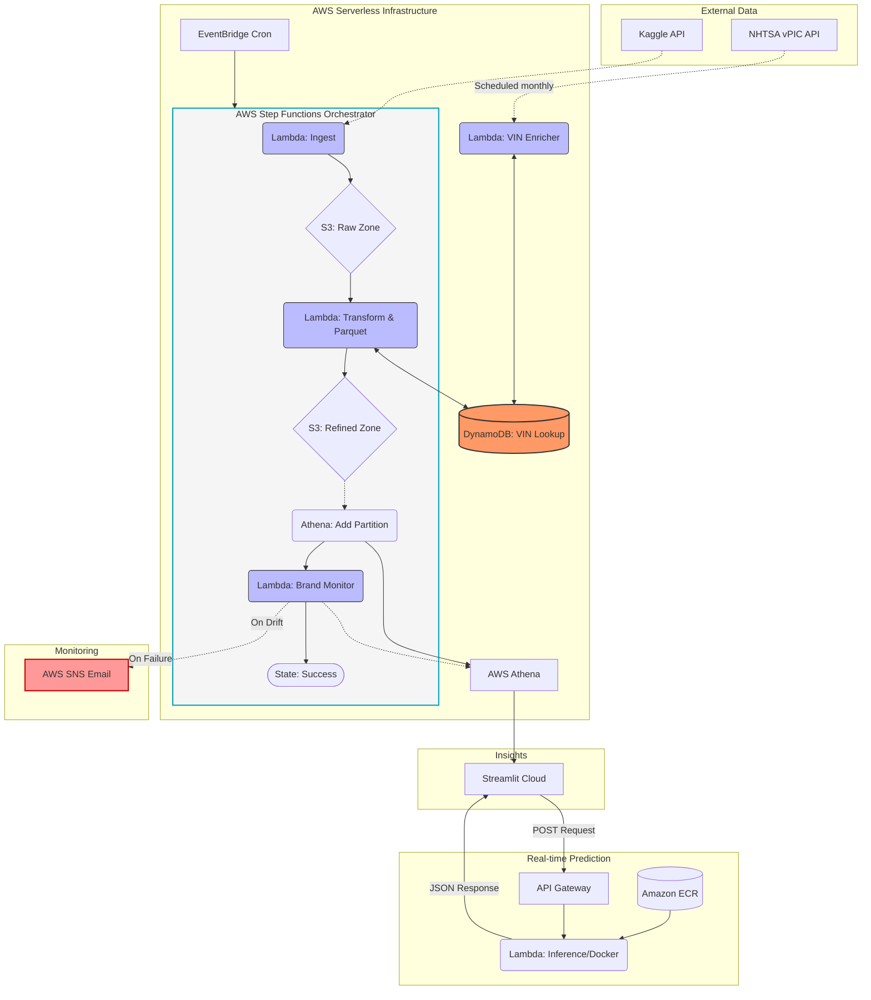

# 🚗 Vehicle Sales Analytics Pipeline

[](https://aws.amazon.com/)
[](https://www.python.org/)
[](https://streamlit.io/)

> **End-to-End Data Engineering project** that automates ingestion, transformation, and visualization of vehicle sales data using a serverless AWS architecture.

🔗 **[Live Dashboard Demo](https://dscloudproject-i3s7cs47ownxgnvko7ptyp.streamlit.app/)**

---

## 📐 Project Architecture & Workflow

The architecture is fully event-driven and automated via a centralized orchestrator:
1. **Trigger & Ingestion:** `Amazon EventBridge` initiates the pipeline monthly. `AWS Lambda` fetches incremental data via the Kaggle API and saves it directly to the S3 Raw Zone.
2. **Processing & Hygiene:** `AWS Lambda` executes deterministic VIN decoding via `Amazon DynamoDB` (NoSQL caching), runs Fuzzy Matching for brand standardization, and drops invalid records.
3. **Storage & Cataloging:** Cleaned data is saved in optimized **Apache Parquet** format into the S3 Refined Zone. `Amazon Athena` dynamically mounts the new partition via an automated `ALTER TABLE` execution.
4. **Data Quality Governance:** A final **Brand Monitor Lambda** analyzes the newest partition via Athena to detect semantic data drift (unknown brands) and triggers **Amazon SNS** alerts if anomalies occur.


```mermaid
graph TD
    subgraph External_Sources [External Data]
        K[Kaggle API]
        N[NHTSA vPIC API]
    end

    subgraph AWS_Cloud [AWS Serverless Infrastructure]
        EB[EventBridge Cron] --> SF_Orchestrator

        subgraph SF_Orchestrator [AWS Step Functions Orchestrator]
            direction TB
            L1(Lambda: Ingest) --> S3R{S3: Raw Zone}
            S3R --> L2(Lambda: Transform & Parquet)
            L2 --> S3P{S3: Refined Zone}
            S3P -.-> AT_Part(Athena: Add Partition)
            AT_Part --> L4(Lambda: Brand Monitor)
            L4 --> SF_Success([State: Success])
        end

        L3(Lambda: VIN Enricher) <--> DDB[(DynamoDB: VIN Lookup)]
        AT[AWS Athena]
    end

    %% Potoki danych (Data Flows)
    K -.-> L1
    N -.->|Scheduled monthly| L3
    L2 <--> DDB
    AT_Part --> AT
    L4 -.-> AT

    subgraph Monitoring [Monitoring]
        SNS[AWS SNS Email]
    end

    SF_Orchestrator -.->|On Failure| SNS
    L4 -.->|On Drift| SNS

    subgraph Presentation [Insights]
        AT --> ST[Streamlit Cloud]
    end

    subgraph Prediction_Layer [Real-time Prediction]
        ECR[(Amazon ECR)] --> L_INF(Lambda: Inference/Docker)
        ST -- POST Request --> APIG[API Gateway]
        APIG --> L_INF
        L_INF -- JSON Response --> ST
    end

    %% Style
    style SF_Orchestrator fill:#f5f5f5,stroke:#00a1c1,stroke-width:2px
    style DDB fill:#f96,stroke:#333,stroke-width:2px
    style L1 fill:#bbf,stroke:#333,stroke-width:1px
    style L2 fill:#bbf,stroke:#333,stroke-width:1px
    style L3 fill:#bbf,stroke:#333,stroke-width:1px
    style L4 fill:#bbf,stroke:#333,stroke-width:1px
    style SNS fill:#ff9999,stroke:#cc0000,stroke-width:2px
```

---

## 🛠️ Tech Stack

* **Compute:** AWS Step Functions, AWS Lambda (Standard & Containerized)
* **Data Engineering (Data Lakehouse):** AWS S3 (Raw & Refined Zones), Amazon Athena, AWS Glue, DynamoDB (NoSQL)
* **MLOps & Automation:** GitHub Actions (CI/CD), Amazon EventBridge, Amazon SNS, Amazon API Gateway, Amazon ECR, Docker
* **Modeling:** XGBoost, Scikit-learn, Optuna (Hyperparameter Tuning), SHAP (Model Explainability), RapidFuzz (Fuzzy Matching), Statsmodels
* **Visualization:** Streamlit Cloud, Pandas, Matplotlib/Seaborn

## 💼 Business Value, FinOps & Key Achievements

### 💰 1. Serverless Data Lakehouse Architecture (FinOps-Driven)
* **Athena vs. RDS (Cost Avoidance):** By choosing a Serverless Data Lake architecture (S3 + Athena) over a traditional relational database (RDS/Aurora), the project avoids fixed 24/7 infrastructure costs, achieving a **near-$0 maintenance cost** when idle.
* **Automated Data Lifecycle:** Integrated automated S3 Lifecycle Rules that automatically purge temporary query results after 7 days and raw data buffers after 30 days, actively preventing storage clutter and unnecessary cloud spend.
* **Risk Mitigation:** Proactively managed via **AWS Budgets** with automated email alerts to monitor threshold credit utilization and eliminate unexpected cloud billing anomalies.

### ⚡ 2. Engineering Efficiency & Performance Optimization
* **90% Compute Cost Reduction:** Implemented a vectorized mapping technique with an early exit strategy. The ingestion algorithm skips canonical brands and processes only "dirty" rows via Fuzzy Matching, cutting Lambda execution time by **over 90%**.
* **High-Speed NoSQL Caching:** Implemented a deterministic VIN-decoding cache layer via **Amazon DynamoDB**. Each unique vehicle identifier is decoded via the NHTSA API only once, drastically reducing latency and external API dependency.
* **Storage & Query Optimization:** Converting the dataset from raw CSV to partitioned **Apache Parquet** minimizes the data scanned by Amazon Athena, ensuring sub-second query performance for the Streamlit UI at a fraction of the cost.

### 🛡️ 3. Data Governance & Model Performance
* **Enterprise-Grade Monitoring:** Dual-purpose alerting strategy via **Amazon SNS**. The pipeline triggers immediate alerts for technical runtime infrastructure failures and business-level anomalies (Data Drift tracking for newly introduced car brands).
* **Impactful ML Accuracy Leap:** Engineered a specialized Hierarchical Modeling Strategy (Luxury vs. Standard segments). For high-end vehicles, the XGBoost model achieved a **13.46% MAPE**, completely crushing the baseline linear model's **81.32% error rate**.
* **Advanced MLOps:** Built a seamless, fully automated deployment loop using **GitHub Actions**. Standard components are pushed as binary zip packages, while the core ML inference engine is automatically containerized via **Docker** and pushed to **Amazon ECR**.

---

## 📊 Dashboard Demo


*The dashboard features a **Smart Buffer** logic: it fetches data once per brand selection to minimize AWS Athena costs while providing instant filtering for production years.*

---

## 📂 Project Structure

The repository is organized into modular components:

### 🔬 Notebooks (Research & Discovery)
Comprehensive documentation of the analytical journey:
* `01_Exploratory_Data_Analysis.ipynb`: Outlier detection (IQR) and market distribution analysis.
* `02_Regression_and_Depreciation.ipynb`: Multicollinearity checks (VIF) and depreciation rate comparisons.
* `03_Classification_Basics.ipynb`: Logistic regression and ROC/AUC performance metrics.
* `04_Advanced_ML_and_Tuning.ipynb`: Bayesian Optimization with **Optuna** and SHAP explainability.
* `05_Final_Production_Pipeline.ipynb`: Hierarchical modeling logic and Log-transformation implementation.

### 💻 Source Code (`/src`)
* `analytics/`: Scripts for data deep-dives and visualization.
* `apps/`: **Smart Buffer Dashboard** – the main interactive interface.
* `data_pipeline/`: Automated data ingestion, S3 uploads, VIN enrichment and new brand monitoring.
* `deployment/`: Lambda handlers and API Gateway testing scripts.
* `model_engineering/`: The core training script for the production-ready models.

---

## 🚀 Key Features

### Phase 1: Local Prototype
This initial phase focused on building the core logic and defining the database schema:
1. `src/data_pipeline/download_data.py`: Fetches raw data from Kaggle to local storage.
2. `src/data_pipeline/upload_to_s3.py`: Transfers CSV files to the AWS S3 `raw_data/` zone.
3. `src/analytics/analyze_data.py`: Connects Python to Athena to generate business insights.
4. `run_pipeline.py`: Orchestrates the local execution of the entire flow.

### Phase 2: Automated Serverless Pipeline
The pipeline was fully migrated to AWS to create a production-grade, hands-off data orchestration loop managed by **AWS Step Functions**.
1. **Centralized Orchestrator (`AWS Step Functions`)**: 
    * Governs the execution flow, handles automatic retries for flaky connections, and implements `Catch` blocks to route technical errors to **Amazon SNS** (`lambda-alerts`).
2. **Ingestion (`src/deployment/lambda_function.py`)**: Executed as Step 1 by the state machine.
    * Fetches incremental data via the Kaggle API and saves it directly to the Raw Zone (`raw_data/{date}/)`.
3.  **Transformation & Parquet Conversion (`src/deployment/lambda_function_parquet.py`)**: Executed as Step 2.
    * **Data Recovery**: Fills missing metadata values by performing high-speed cache lookups against **DynamoDB**.
    * **Normalization**: Standardizes messy vehicle brand names using Fuzzy Matching (`RapidFuzz`) and formatting filters.
    * **Storage Optimization**: Converts the cleaned DataFrame into **Apache Parquet** files in-memory (`io.BytesIO`) and streams them to the **Refined Zone**.
4.  **Automated Partitioning (`Native Athena Integration)`**:
    * Step Functions natively calls Amazon Athena (`startQueryExecution.sync`) to mount the newly created partition (`ALTER TABLE ... ADD PARTITION`) passing runtime context variables (`year/month`) without spawning redundant compute.
5.  **Semantic Brand Drift Monitoring (`src/data_pipeline/brand_monitor.py`)**: Executed as Step 3. 
    * Runs an analytical query over the new partition. 
    * If unmapped or unknown car brands enter the pipeline, it fires an immediate business alert via **Amazon SNS**.
6.  **Background Cache Layer (`src/data_pipeline/vin_enricher.py`)**: 
    * An isolated worker triggered periodically by an **EventBridge Cron**. It fetches structural data from the official **NHTSA API** based on unknown VINs and hydrates the **DynamoDB** cache table.

### Phase 3: Data Visualization & Serving
Developed a serverless dashboard using Streamlit Cloud with two architectural approaches:
1. **Cloud-Heavy Approach (`src/apps/dashboard_cloud_heavy.py`)**: 
    * Delegates all aggregations to AWS Athena. 
    * Best for massive datasets, but yields higher S3 scanning costs.
2. **Smart Buffer Approach (`src/apps/dashboard_smart_buffer.py`)**: 
    * Fetches full brand data into a local Pandas DataFrame buffer and performs sub-filtering on the fly. 
    * Selected for production due to supreme UX and massive AWS cost reduction.
3. **Data Cleaning at Source**: Implemented Trino-compatible SQL logic directly in Athena to filter out `NULL/Nan` elements, protecting the Streamlit UI from messy data.

### Phase 4: Predictive Price Model
#### 1. Hierarchical Modeling Strategy
To handle market diversity, the system uses two specialized models:
- **Luxury Model:** Fine-tuned for high-end brands (Ferrari, Lamborghini, Tesla, etc.).
- **Standard Model:** Optimized for high-volume market segments.

#### 2. Serverless Inference
The model is packaged into a **Docker Container** and deployed as an AWS Lambda function. This allows for near-instant scaling and "pay-as-you-go" execution costs.

#### 3. Interactive Market Dashboard
* Real-time price predictions via API calls.
* Geographic sales distribution analysis.
* Comparison of depreciation rates across brands.
* Top 5 "Best Value" deals identification.

---
## 📈 Model Performance
The **13.46% MAPE for Luxury models** is particularly impressive given the high variance in high-end vehicle pricing, where the **MAPE** of the **baseline linear model** was **81.32%.**

| Segment | MAE | MAPE | Key Logic |
| :--- | :--- | :--- | :--- |
| Baseline (Simple Linear Regression) | $3380 | 81.32% | Targeted at all brands. |
| Luxury (XGBoost + Log-Trans) | $3766 | 14.75% | Targeted at brands like Ferrari, Tesla, Land Rover. |
| Standard (XGBoost + Log-Trans) | $1598 | 16.39% | Optimized for high-volume makes like Ford, Toyota. |

---

## 🚀 Future Improvements & Roadmap

As the project grows, the following features are planned to enhance its robustness and analytical depth:

### 🏗️ Data Engineering & DevOps
* **Data Build Tool (dbt)**: Integrate `dbt-athena` to manage complex SQL transformations and data lineage directly in the Refined Zone.

### 📈 Advanced Analytics & Machine Learning
* **Interactive EDA Dashboard**: Expand the Streamlit UI with an Exploratory Data Analysis module to uncover hidden correlations (e.g., price vs. regional popularity).
* **External Data Enrichment**: Implement Web Scraping to fetch real-time exchange rates or inflation data to analyze their impact on car market volatility.
* **Data Quality Dashboard**: Add a dedicated view in Streamlit to monitor the % of recovered records via VIN decoding.

---

## ⚙️ Setup & Installation

### 1. Prerequisites
* AWS Account with CLI configured.
* Kaggle API Token (`KAGGLE_USERNAME`, `KAGGLE_KEY`).

### 2. AWS Environment Variables
Set these variables in your Lambda functions:
* `BUCKET_NAME`: Target S3 bucket name (`lambda_function.py`, `lambda_function_parquet.py`).
* `SNS_TOPIC_ARN`: ARN for failure alerts (`lambda_function.py`, `lambda_function_parquet.py`).
* `KAGGLE_USERNAME` / `KAGGLE_KEY`: For data ingestion (`lambda_function.py`). Obtain these from Kaggle Account settings -> Create New API Token. 
* `S3_STAGING_DIR`: The S3 path where Athena will store query results (e.g., s3://your-bucket-name/athena-results/).

### 3. Lambda requirements
* **Runtime**: Python 3.12
* **Timeout**: 
  * Ingest/Parquet: 2-3 minutes (due to DynamoDB lookups)
  * VIN Enricher: 5-15 minutes (due to external API calls)
* **Memory**: 1024 MB
* **Layers**: 
  * `AWSSDKPandas-Python312`
  * Custom Layer: `kaggle`, `requests`, `rapidfuzz`
* **Permissions**: `AmazonS3FullAccess`, `AmazonAthenaFullAccess`, `AmazonDynamoDBFullAccess`, `CloudWatchLogsFullAccess`, `AmazonSNSFullAccess`.

### 4. **Custom Layer Creation**: To use the Kaggle API in Lambda, create a custom layer:
```bash
mkdir -p kaggle_layer/python
cd kaggle_layer/python
pip install kaggle -t .
cd ..
zip -r kaggle_layer.zip python
aws lambda publish-layer-version --layer-name kaggle-library --zip-file fileb://kaggle_layer.zip --compatible-runtimes python3.12
```
### 5. **Container Image**
The pricing model is deployed via Docker. Ensure AWS ECR repository is created before running push commands from the CI/CD context.
1. **Build**: `docker build -t car-valuation-lambda .`
2. **Tag**: `docker tag car-valuation-lambda:latest <ACCOUNT_ID>.dkr.ecr.<REGION>.amazonaws.com/car-valuation-lambda:latest`
3. **Push**: `docker push <ACCOUNT_ID>.dkr.ecr.<REGION>.amazonaws.com/car-valuation-lambda:latest`
*Note: Ensure your Lambda function is configured to use the 'Image' package type and has the necessary IAM permissions to pull from ECR.*

### 6. Database Setup (NoSQL)
Before running the enrichment Lambdas, create a DynamoDB table:
- **Table Name**: `VIN_Lookup`
- **Partition Key**: `vin` (String)
- **Capacity Mode**: On-Demand (to keep costs near $0 for low/medium traffic).

### 7. Other
* `sql/create_table_vehicle_sales_parquet.sql`: SQL DDL for the optimized Parquet-based partitioned table.
* `sql/create_table_vehicle_sales.sql`: Defines the initial schema for raw CSV data.